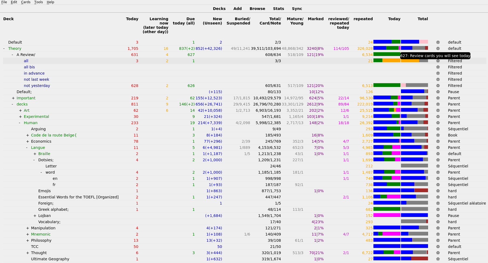

# anki-enhance-main-window
Adds a lot of features to the main window. Allows configuration of those features. Configurations are explained at the end of this document.

Important updates:
* 5th of June 2019: A column for flags, and columns for each flag
* 30th of March 2019: column can be dragged and dropped, and use right click to delete.
* 12 February 2019: default colors are changed to use the color of the statistic window.
* 11 February 2019: percent bar
* February: counting the number of reviews, today and any time in the past, and the number of cards seen today.
* 19th January 2019: many bugs corrected. Configuration can be changed without restarting Anki.
* 8th November 2018: you can configure the add-on using anki 2.1's
  configuration method. The configuration won't be lost during next update of the add-on !

# Features
## Column
Most features offered by this add-on are related to some column.

You can change the order of the columns by dragging their name and dropping them at their new position.
### Name of the (sub)deck
There is not a lot of change in this column, apart from the decks's color.
#### Empty decks
If a (sub)deck is empty, it turns red. (You can configure the color.)

This may not be useful for everybody. But if you want to know when a deck is empty in order to add new notes in it, it avoids having to check the number of new cards for each deck. For example, if you want to learn guitar chords, it will let you know that it is time to add new chords to Anki.

Whats even better ! If you use subdecks, the ancestors (parent) of an empty subdeck become blue (also configurable). This allows you to find decks with an empty subdeck. Hence, it helps finding empty subdecks without having to expand every top-level deck.

Note that, in some cases, you don't want the name to become red, e.g. you wanted to learn the name of the Greek letters. When you know all of them, you won't add any new note ever. You just have to add a semicolon (;) (that is configurable) to the name of the deck, and it will not turn red.
#### Marked cards
Decks with marked card have a blue background (configurable). Furthermore, if the deck's name contains a semicolon (i.e. as explained above, the deck is ended), then the background become yellow.

### Learning
The number of reviews of cards in learning. By default you will see the number of reviews that can be done now, and in parentheses the number of reviews which can be done later today.

### Review
The number of cards which you have seen in the past, and that you should see today. By default, the number of cards you will see today. And in parentheses the number of cards you should see today, but that you will not see today because of your limit.

### New today
This column called new in Anki. New means «number of new cards you will see today», with the caveat that it is not exactly true for subdecks.

### New
The column name "new" is deprecated. It is kept for backwards compatibility, but may be removed one day. It is the same thing as New Today.

### Due
By default, this column is hidden. Indeed, it became two columns «due now» and «later». We recall that, in Anki, a due card is a card which is not new, and that you have to view again today.

### Unseen
The number of cards which you have never answered. Most of these cards are cards you have never seen, but it also considers cards you have seen and buried. By default, the number of unseen cards which you will discover today, and in parentheses the number of unseen cards you will not see today.

### Young
The number of cards whose interval is less than 3 weeks

### Mature
The number of cards whose interval is at least 3 weeks

### Buried
The number of Buried cards. Keep in mind that a buried card is a card you will not see today, either because you pressed the «bury» button, or because you saw another card from the same note, so it was automatically buried.

### Suspended
The number of Suspended cards. Keep in mind that a suspended card is a card you will never see again, unless you unsuspend it manually (using the browser).

### Total
The number of cards in this deck. It is not the sum of the preceding column, since it contains also cards you have already seen and which are not yet due (and it counts a card with multiple reviews once).

### Today
The total number of reviews you will see today (assuming you always rate good).

### Configuration
The last column states which options group is used for the current deck. This avoids the pain of opening the menu to see the option names. Really useful when you have a lot of decks and want to see which is the last deck which used this old configuration you want to delete.

## Capping
By default, Anki does not show any number greater than 1000. Instead it shows 1000+.
You can now edit this limit, or remove it entirely (by using a negative number). If you set the limit to 0, you will either see a 0, or "+".

How to configure this add-on
===========================
Most options are configurable. If some option is not configurable, send me an email and I'll see what I can do.

In order to configure this add-on (hence, to configure what is shown in the main window), go to Tools>add-ons>[name of this add-on]>Config. You'll see the configuration file. It will also display in a small window a display of the configuration's rule. We copy them below

# Configuration file

# Configuration of Anki's addon Enhanced Main
1. We first discuss the various small configurations related to the whole add-on.
1. We then explain how to configure each column.
1. We then explain how to configure coloring related to empty deck.
1. We finally explain how to configure coloring related to marked cards.

## Miscelaneous
In this section, we describe various small configurations related to
the whole add-on.

### CSS
If the value is `null` then the default css is used. Otherwise, you can put the CSS you want here.  Use the add-on [Newline in strings in add-ons configurations](https://ankiweb.net/shared/info/112201952) if you want to use newline in JSON/CSS string.

### Refresh rate
How much time to wait between refreshing the main window. In seconds. By default, the window is refreshed every 30 seconds, thus, it is possible that change made less than half a minute ago are not yet shown.

### Option
Whether you want to display the deck's Option group's name, at the end of its line.

### cap value
By default, without add-on, Anki never shows number greater than a thousand. Instead, it shows 1000+. You can decide to change a thousand by an arbitrary number. Or leave this value to null, and always show the real value.

Note that capping to a thousand does not usually make the rendering quicker.

## Columns

Each column should occur after the line "columns" :[, and before the line with a closing bracket ]. The order of the lines is important, since it's the order in which columns will be displayed by anki. This order can also be changed by dragging and dropping the column title. This means that you can reorder columns in anki by reordering the lines in the configuration. You can copy a line to display a column multiple time (for example, once using percent, and another time using absolute number).

Each column is represented between an opening curly bracket {, and a closing curly bracket }. Each column uses 8 parameters, each represented as a pair `key:value`. We'll tell you the meaning of each key, whether you can change its value, and what will this change do.

### Name
The first value is a description, which will tell you what the column represent. Do NOT alter this value, or the add-on will raise an error.

### Description
A description of the content of the column. This is not used by anki, it allows you to decide whether you want the column or not while you edit the configuration.

### Present
The value for the key "present" is either true or false. If the value is true, the column will be displayed. Otherwise, it will not. Note that you can also delete the entire column from the configuration, instead of changing the value to false.

If this value is absent, by default, it is assumed that it should be true.

### Header
The header of the column. If you leave «null» then the default header will be used. This description will be translated as much as it is possible to do it automatically. However, you can also choose to write your own description. You can use html in this description. I.e. you should use " " when you want a newline.

### Overlay
The text shown when your mouse is over a number. It will describe what this number represent. You can remove this key if you want no description to be present. And leave this value to null if you want to use the default value.

### Color
The color in which the number is shown in this column. You can use any color acceptable in an HTML document. The most standard color's name should work.

### Percent
true or false whether you want to show the percent of cards satisfying this column condition. For example, 23% of cards are new. Note that sometimes, this would not make sense. For example, for the column «cards», the value will always be 100% (unless the deck is empty). For the column notes, the number would not really make any sens (formally, you'd get the percent of cards which is the first of its sibling in this deck).

By default, percent is assumed to be false if absent.

### Absolute
Whether you want an absolute number in your column or not. That is, a number which is not a percent, but an exact number.

By default, this value is false if Percent is set to true, otherwise its default value is true.

### Subdecks
When you consider a deck which has subdecks, you may want to consider cards in subdecks (it is done when the value is true), or you may want to ignore them (it is done when the value is false).

## Percent Bar
If the name is "bar", instead of a number, the column contain a percent bar.

In this case, the configuration of this column must contain a field "names", whose value is a list of name. The names are the same name than for columns. It uses the same color and overlay.

## Coloring decks
The author of this add-on want to know when a deck is empty. This is very important to him, because he want to add new cards in them as soon as possible. Thus, this add-on change the color of the name of empty decks, and of name of decks with an empty descendant.

The author also want to know which deck has marked card. Thus, the background of the deck's name with marked card change color.

Both of those configuration can be changed as explained in this section. In particular, you can turn one or both of those options off by setting "color empty" and "color marked" to false.
### Choice of color
#### Color empty
The color of the name of decks without new cards

#### Color empty descendant
The color of the name of decks with a descendant without new cards

#### Default color
The color of a deck whose every descendant has new cards.

#### ended marked background color
The color of the decks which has an ended deck with marked cards. The  notion of ended deck will be explained in the next section of this documentation.

#### marked background color
The color of deck who have marked cards but none of its descendant are both ended and has marked card.

### Deck modifier
A deck modifier is a symbol (or a word, etc..) whose presence in a deck name change the meaning of the deck. When the meaning is changed, the coloration is also change. It's not clear to the author of this add-on whether anyone appart from himself will need those, but if you want to use them, here is the explanation.

The first  three symbols currently has the same effect, but it may occur that one day this effect may change, according of what the author want to do.
#### End symbol
By default, this symbol is ";". It means that the deck is definitively done, and no new card may ever be added to it. When a deck has this symbol, neither itself nor its descendant will ever be colored.

#### Given up symbol
By default, this symbol is "/".To the author, it means that no new card will be added because this deck is either too hard, or not interesting enough.

#### Pause symbol"
By default, this symbol is "=". To the author, it means that more new card will be added latter, but right now it does not want anki to change the color of the deck's name. In a future version, there may be an option to change the color of those decks.

## Internals
* In `aqt.deckbrowser`, change `DeckBrowser._renderDeckTree`, `DeckBrowser.refresh` and `DeckBrowser._deckRow`. The former methods are not called.
* In `Anki.notes`, change `Note.flush`. The new method calls the former one.
* In `anki.decks` change `DeckManager.save`, calling the former method. Changing `DeckManager.collaps`, not calling the former method.

## Documentation for developpers
See [Documentation.md](Documentation.md)

## Links, licence and credits

Key          |Value
-------------|-------------------------------------------------------------------
Copyright    |Arthur Milchior <arthur@milchior.fr>
Based on     |Anki code by Damien Elmes <anki@ichi2.net>
Based on     |Helen Foster's code, in add-on "Deck_Counts_Now_Later"
Original idea|Juda Kaleta <juda.kaleta@gmail.com>
Somme CSS    |Some idea from cjdduarte
Bug correction|telotortium on Github
Percent bar | Idea and partial realization by Kyle "Khonkhortisan" Mills
License      |GNU AGPL, version 3 or later; http://www.gnu.org/licenses/agpl.html
Source in    | https://github.com/Arthur-Milchior/anki-enhance-main-window
Addon number | [877182321](https://ankiweb.net/shared/info/877182321)
